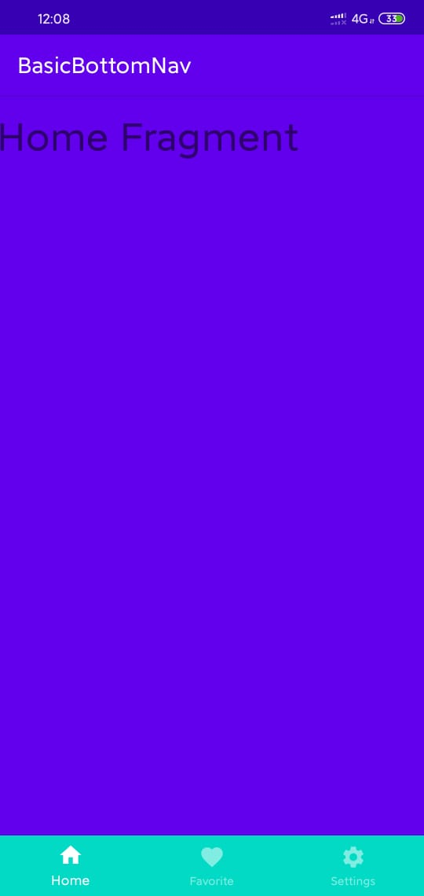

## Images added:

<kbd></kbd> 


## Material Styles : 
### under Xml file where BottomNavigation is declared.
-The default Material BottomNavigationView style: consists of updated colors, text sizing, and behavior. The default BottomNavigationView has white background and icons and text colored with colorPrimary.
```
style="@style/Widget.MaterialComponents.BottomNavigationView"
```

-Colored Material Style:
This style inherits from the default style but sets the colors to different mappings. Use the colored style to get a bottom navigation bar with a colorPrimary background and shades of white for the icon and text colors.
```
style="@style/Widget.MaterialComponents.BottomNavigationView.Colored"
```
